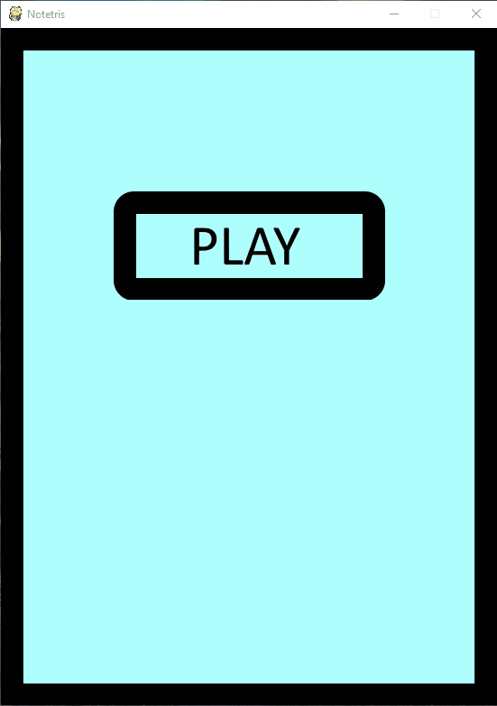

# Notris
A Tetris style game for learning to distinguish different musical notes.

## Use  
Notris is an attempt at an engaging way to train your ears to recognize distinct musical notes. This project is a prototype for an 
eventual mobile application. Although not audible in the .gif above, when each box spawns into the game, a note is played. The player
must switch through all of the different notes and select the correct one. If the user matches 3 of the same note in a row, they receive
points. After reaching a certain score, they're allowed to progress to the next level or continue to play to train in the same game.
The first level is quite simple, only using three notes to help build a foundation for the rest of the game.

## Future Improvements<ul>
<li>Many more levels</li>
<li>High scores</li>
<li>An even greater range of possible notes</li>
<li>Flats and minors</li>
<li>Higher quality audio files</li>
<li>Improved GUI graphics</li>
</ul>

## Contact
If you have any questions about this project, please email me at dylkinder@gmail.com.

Enjoy!
